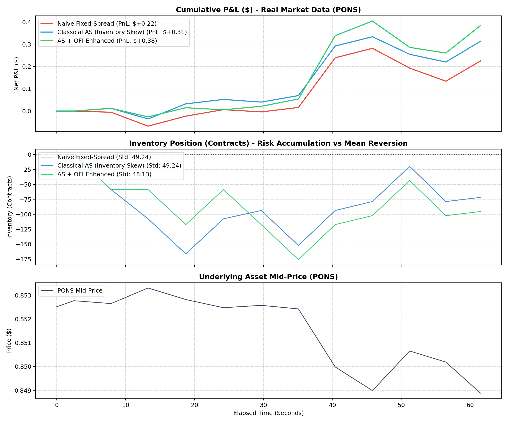

# Quantix // High-Frequency Microstructure Market Making Engine

A high-frequency market making engine and control dashboard designed for small-capital quantitative traders ($500 – $5,000). The system exploits capacity-constrained long-tail order books on crypto perpetual exchanges (Hyperliquid) where tier-1 institutional firms cannot trade due to market impact.



## Core Architecture & Alpha Strategy

1. **Avellaneda-Stoikov Reservation Price:**
   $$r(s, q) = s \times \left(1 - q_{\text{norm}} \cdot \gamma \cdot \sigma\right)$$
   Penalizes holding inventory to prevent position accumulation and dynamically mean-reverts back to flat.

2. **Order Flow Imbalance (OFI) Skew:**
   $$\text{OFI}_t = \Delta Q_{\text{bid}} - \Delta Q_{\text{ask}}$$
   $$r^*(s, q) = r(s, q) + \beta_{\text{ofi}} \cdot \tanh\left(\frac{\text{OFI}_t}{50}\right) \cdot \frac{\text{Spread}}{2}$$
   Anticipates aggressive market sweeps 50ms–1s in advance and asymmetrically shifts or cancels vulnerable quotes.

3. **Discrete Event Matching Engine:**
   * 10ms simulated transit latency delay.
   * Post-only limit order queue priority.
   * Realistic fill matching against live market trade streams.
   * Adverse selection tracking (+1s and +5s post-fill returns).

---

## Quick Start (Docker Deployment)

### 1. Run with Docker Compose
```bash
docker compose up --build -d
```

### 2. Access the Web Dashboard
Open [http://localhost:8000](http://localhost:8000) in your browser.

* **Start/Stop Engine:** One-click controls with real-time parameter tuning.
* **Scan Pairs:** Built-in screener finds newly active high-spread pairs across the exchange.
* **Live Ladder:** Visualizes the order book with our active quotes highlighted inside the spread.
* **Equity & P&L Curve:** Real-time Chart.js telemetry stream via WebSockets.

---

## Local Development (Without Docker)

1. **Install Dependencies:**
   ```bash
   pip install -r requirements.txt
   ```

2. **Run Unit Tests:**
   ```bash
   python -m unittest test_microstructure.py
   ```

3. **Run the Market Screener:**
   ```bash
   python screener.py
   ```

4. **Record Live Tick Data:**
   ```bash
   python data_collector.py PONS 60
   ```

5. **Run Backtest Replay:**
   ```bash
   python run_backtest.py tick_data_pons.jsonl PONS
   ```

6. **Start Local Server:**
   ```bash
   python -m uvicorn server:app --host 0.0.0.0 --port 8000 --reload
   ```

---

## API Endpoints

* `GET /api/status`: Current bot state, parameters, equity, and inventory.
* `POST /api/start`: Starts simulated or live quoting with specified config.
* `POST /api/stop`: Stops quoting immediately.
* `POST /api/reset`: Resets paper capital to $1,000.
* `GET /api/screener`: Scans Hyperliquid for high-spread/high-volume tokens.
* `WS /ws/live`: Real-time bi-directional telemetry broadcast at 4Hz.

---

## Repository Structure

```
├── Dockerfile                  # Production container definition
├── docker-compose.yml          # Container orchestration
├── requirements.txt            # Python dependencies
├── signals.py                  # Avellaneda-Stoikov & OFI mathematics
├── engine.py                   # Event-driven matching simulator
├── trader.py                   # Live trading state machine & WebSocket listener
├── server.py                   # FastAPI REST & WebSocket server
├── screener.py                 # Exchange volume & spread screener
├── data_collector.py           # Real-time WebSocket tick recorder
├── run_backtest.py             # Multi-strategy benchmark runner
├── test_microstructure.py      # Unit tests
└── web/                        # Web Dashboard frontend
    ├── index.html              # Modern dark-theme UI
    ├── styles.css              # Cyberpunk/quant styling
    └── app.js                  # WebSocket client & Chart.js logic
```

## License
MIT License
